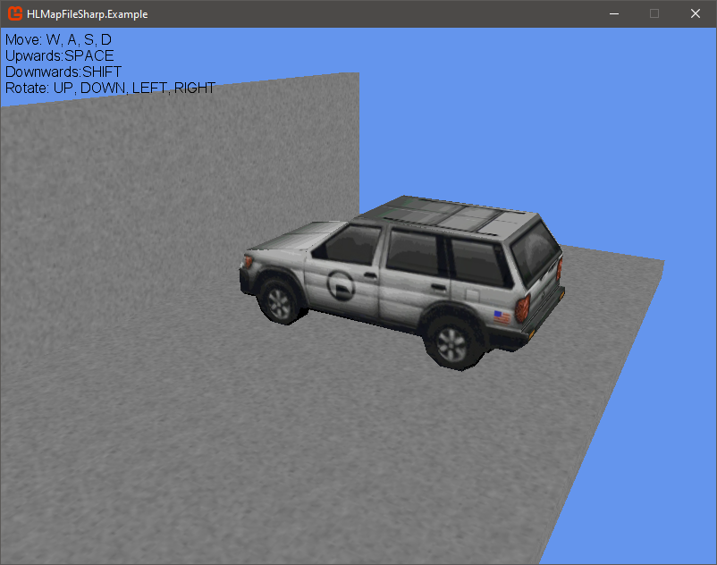
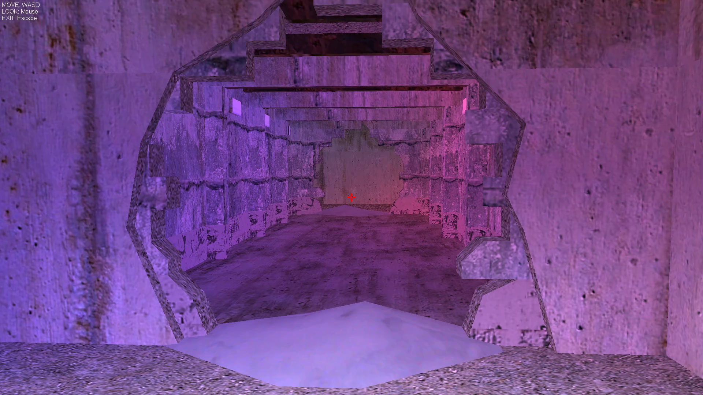
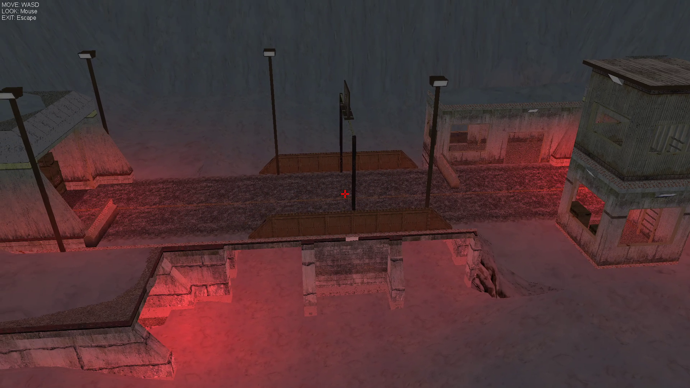

# Half-Life .map File Loader Example

### Description
Example of how to implement and use the HLMapFileLoader project to load a simple .map from Valve Hammer Editor.

### Prerequisites
* Microsoft Visual Studio 2012+
* MonoGame
* [HLMapFileLoader](https://github.com/j0nat/HLMapFileLoader)

**Pictures from larger .map file with some lighting effects**

